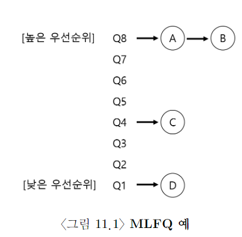
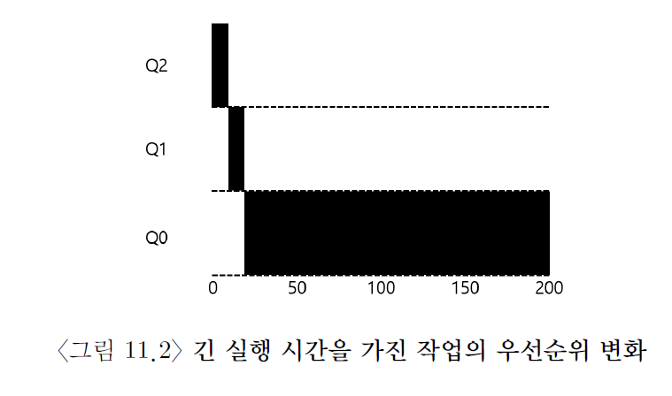
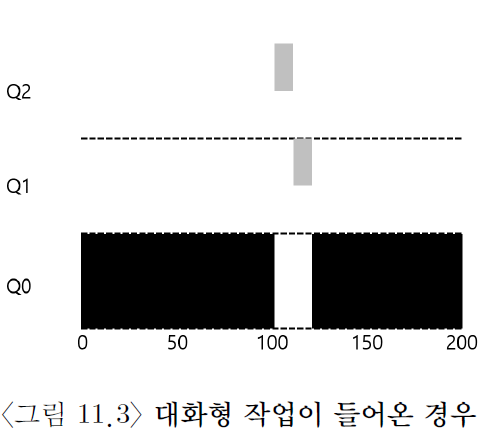

# MLFQ

MLFQ가 해결하려고 하는 기본적인 문제는 2개

1. 짧은 작업을 먼저 실행시켜서 turnaround time을 최적화
2. 대화형 사용자를 위해 response time을 최적화

프로세스에 대한 정보가 없다면 이런 스케줄러를 어떻게 만들 수 있을까?

# MLFQ: 기본 규칙

- MLFQ는 여러 개의 큐로 구성
- 각각 다른 priority level 배정
- 실행 준비가 된 process는 이 중 하나의 큐에 존재
- 높은 우선 순위 큐에 존재하는 작업이 선택된다.
- 같은 큐에는 둘 이상의 작업이 존재 가능하다. 이들은 RR 스케줄링 알고리즘을 통해 스케줄링이 된다.
- MLFQ는 각 작업에 고정된 priority를 부여하는 게 아니라, 각 작업의 특성에 따라 동적으로 priority를 부여

## 예시

위의 그림을 보면 A와 B를 번갈아 실행할 것이다. C와 D는 실행되지도 않는다. 작업 우선순위가 시간에 따라 어떻게 변하는지도 차차 알아 볼 것이다.

# 시도 1: 우선 순위 변경

MLFQ가 작업의 우선순위를 어떻게 바꿀 것인가 결정해야 한다. 이는 곧 작업이 존재할 큐를 결정하는 것과 같은 의미이다.
이를 위해서는 워크로드의 특성을 반영해야 한다. 다음과 같은 규칙을 새로 추가해 보자.

- 규칙 3: 작업이 시스템에 진입하면, 가장 높은 우선순위에 진입한다.
- 규칙 4a: 주어진 time slice를 모두 소진하면, 한 단계 아래 큐로 내려간다.
- 규칙 4b: time slice를 모두 소진하기 전에 CPU를 양도하면 같은 priority를 유지한다.

## 예시 1: 한 개의 긴 실행시간을 가진 작업

위의 그림에서 작업은 최고 우선 순위인 Q2로 진입한다. 10ms time slice가 소진되면, 스케줄러는 작업의 우선 순위를 한 단계 낮춘다. (Q2->Q1)
또 다시 하나의 time slice인 10ms가 지나면, Q0로 옮겨가게 되고, 앞으로는 계속 거기서 머무른다.

## 예시 2: 짧은 작업과 함께

작업 A는 오래 실행되는 CPU 위주의 작업이다. 새로 들어온 작업 B는 짧은 대화형 작업이다.
어떤 일이 벌어질까? MLFQ는 SJF와 근사하게 동작해서 B를 선호할까?
그림을 확인하면 B가 들어오면 일단 짧은 작업이라고 가정해서 가장 우선 순위가 높은 큐에 넣고, time slice를 돌린다. 그리고 time slice를 소진하면 한 단계 강등시킨다. B는 짧은 작업이기 때문에 Q0로 내려오기전에 종료가 된다.
이 예시에서 이 알고리즘의 주요 목표를 알 수 있다. 스케줄러는 작업이 짧은지 긴지 알 수가 없다. 그래서 일단 짧은 작업이라고 가정을 하여, 높은 priority를 부여한다. 진정으로 짧은 작업이면 빨리 실행되고 종료될 것이다. 그게 아니라면 점진적으로 아랫 큐로 이동을 하고, 스스로 긴 batch형 작업이라는 걸 증명한다. 이런 방식으로 MLFQ는 SJF를 근사한다.

## 예시 3: I/O 작업에 대해서는?

작업 B(회색)는 대화형 작업으로서 I/O를 수행하기 위해 1ms 동안만 실행된다. 작업 A(검은색)는 긴 batch형 작업으로 B와 CPU를 사용하기 위해 경쟁한다. B는 대화형 작업이기 때문에 time slice를 소진하기 전에 CPU를 양도한다. 그래서 계속 높은 우선순위 큐에 머무를 수 있다. MLFQ는 대화형 작업을 빨리 실행시킨다는 목표에 더 근접한다.

# 현재 MLFQ의 문제점

1. starvation 문제. 너무 많은 대화형 작업들이 존재하면, 긴 batch 작업들은 CPU 시간을 할당 받지 못한다.
2. 스케줄러를 악용하는 문제. 예를 들어 time slice의 99%를 실행하고, CPU를 양도하면, 그 작업이 CPU를 독점하게 될 것이다.
3. 프로그램은 시간에 흐름에 따라 특성이 변할 수 있다. CPU-집중 작업이 대화형 작업으로 변할 수도 있는 것이다. 현재 MLFQ는 그런 작업은 다른 대화형 작업과 같은 대우를 받지 못한다.

# 시도 2: 우선순위의 상향 조정

위에서 말한 1, 3 번 문제점을 해결하기 위해 새로운 규칙을 도입한다.

- 규칙 5: 일정 시간 S가 지나면, 시스템의 모든 작업을 최상위 큐로 옮긴다.

그러면 starvation의 위기에 처한 긴 batch형 작업도 CPU 시간을 할당 받고, CPU-집중 -> 대화형 작업으로 변한 작업도 그에 맞는 대우를 받게 될 수 있다.

# 시도 3: 더 나은 시간 측정

위에서 말한 2 번 문제점을 해결하기 위해 새로운 규칙을 도입한다.

- 규칙 4: 주어진 단계에서 시간 할당량을 소진하면 (CPU를 몇 번 양도했는지 상관 없이), 우선 순위는 낮아진다. (즉, 아랫 큐로 이동한다.)

위의 그림을 보자. 왼쪽은 time slice를 다 소진하기 직전에 CPU를 양도해서 계속 높은 우선 순위를 유지하고, CPU를 독점한다. 오른쪽은 각 큐에서 프로세스에 할당된 시간 할당량을 소진하자, 아랫 큐로 계속 이동하는 것을 볼 수 있다.

# MLFQ 조정과 다른 쟁점들

이건 정리 안 함.

# MLFQ: 요약

우리는 멀티 레벨 피드백 큐로 알려진 스케줄링 방법을 기술하였다. 이제 왜 그런 이름으로 불리는지 이해했을 것이다. 알고리즘은 멀티 레벨 큐를 가지고 있으며, 지정된 작업의 우선순위를 정하기 위하여 피드백을 사용한다. 과거에 보여준 행동이 우선순위 지정의 지침이 된다. 작업이 시간이 지남에 따라 어떻게 행동하고 그에 맞게 어떻게 처리하는지에 대해 주의를 기울여라. 이 장 전체에 산재해 있는 정교한 MLFQ 규칙의 집합을 보기 쉽게 여기에 다시 적어 보았다.

- 규칙 1 : 우선순위 (A)> 우선순위 (B) 일 경우, A가 실행, B는 실행되지 􁦫는다.
- 규칙 2 : 우선순위 (A) = 우선순위 (B), A와 B는 RR 방식으로 실행된다.
- 규칙 3 : 작업이 시스템에 들어가면 최상위 큐에 배치된다.
- 규칙 4 : 작업이 지정된 단계에서 배정받은 시간을 소진하면 (CPU를 포기한 횟수와 상관없이), 작업의 우선순위는 감소한다 (즉, 한 단계 아래 큐로 이동한다).
- 규칙 5 : 일정 주기 S 가 지난 후, 시스템의 모든 작업을 최상위 큐로 이동시킨다.

MLFQ는 다음과 같은 측면에서 매우 흥미로운 스케줄러이다. 작업의 특성에 대한 정보 없이, 작업의 실행을 관찰한 후 그에 따라 우선순위를 지정한다. MLFQ는 반환 시간과 응답 시간을 모두 최적화한다. 짧게 실행되는 대화형 작업에 대해서는 우수한 전반적인 성능을 제공한다 (SJF/ STCF와 유사). 오래 실행되는 CPU-집중 워크로드에 대해서는 공정하게 실행하고 조금이라도 진행되도록 한다. 이런 이유로 BSD Unix와 여기서 파생된 다양한 운영체제 [Lef+89; Bac86], Solaris [McD06], Windows NT 및 이후 Windows 운영체제 [CS97]를 포함한 많은 시스템이 기본 스케줄러로 MLFQ를 사용한다.
