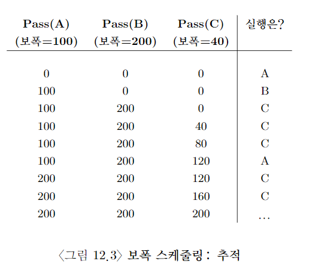

# 비례 배분(Proportional Share), 공정 배분(fair share) 스케줄러

- turnaround time이나 response time을 최적화하는 대신에 스케줄러가 각 작업에게 CPU의 일정 비율을 보장하는 것이 목적

- lottery scheduling은 다음 실행될 프로세스를 추첨을 통해 결정

- 더 자주 수행돼야 할 프로세스는 당첨 기회를 더 많이 준다.

# 기본 개념: 추첨권이 당신의 몫을 나타낸다.

- ticket이라는 기본 개념이 이 추첨 스케줄링의 근간을 이룬다.

- A에게 CPU의 75%를, B에게 CPU의 25%를 할당하는 게 목적.

- 그러면 간단하다. 스케줄러는 총 몇장의 티켓이 있는지 알면 된다. (100장이라 가정)

- 그러고 A에게 75장, B에게 25장을 준다.

- 그리고 100장 중에 아무 티켓을 뽑는다. 끝

- 그렇지만 75:25의 비율만큼 티켓이 뽑히지 않는다. 큰 수의 법칙에 따라 두 프로세스가 장시간 실행될수록 수렴될 뿐...

# 추첨 기법

- 추첨권 화폐: 사용자가 자신의 화폐 가치로 추첨권을 자유롭게 할당하도록 허용.

- 추첨권 양도: 양도를 통해 프로세스는 일시적으로 추첨권을 딴 프로세스에게 양도 가능. 주로 Client-Server환경에서 유용.

- 추첨권 팽창: 자신이 소유한 추첨권의 수를 늘이거나 줄임. 프로세스들이 서로 신뢰할 때 유용.

# 불공정도

- 추첨 방식은 작업 길이가 길지 않으면, 평균 불공정도가 심각하다 ㅎㄷㄷ.

# 보폭 스케줄링

- 프로세스들끼리 달리기 시키고, 가장 꼴찌 밀어주는 형태

