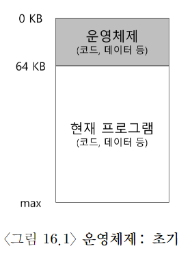
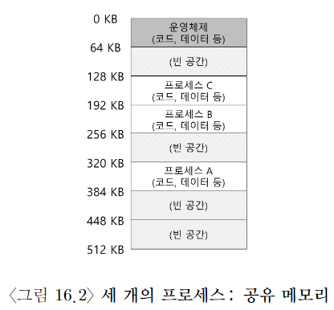
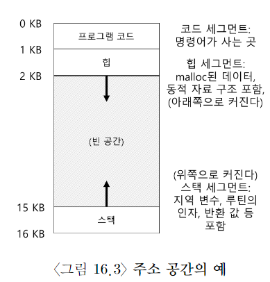

# 초기 컴퓨터 시스템

- 메모리 관점에서 초기 컴퓨터 시스템은 많은 개념을 사용자에게 제공 X

- 초기 운영체제의 물리 메모리는 위와 같았다.

- OS는 물리 메모리에(위 그림에서 물리 주소 0부터) 상주하는 루틴(라이브러리)의 집합이었다.

- 물리 메모리에 하나의 실행 중인 프로그램이 존재했고(위의 그림에서는 물리 주소 64KB부터), 나머지 메모리를 사용했다.

- 특별한 virtualization이 존재 X.

# 멀티 프로그래밍과 시분할

- 사람들은 더욱 효과적을 컴퓨터를 공유하기 시작.

- multi-programming 시대가 도래.

- 여러 프로세스가 실행 준비 상태 -> OS는 이들을 전환하면서 실행.

- ex: 한 프로세스가 I/O blocking이 되면, CPU는 딴 프로세스로 전환

- 이런 전환이 CPU 이용률 증가로 이어 짐.

- time-sharing의 시대가 시작.

- batch computing의 한계를 인식. 대화식 이용(interactivity) 개념이 중요하게 됨.

- 시분할 구현 방법: 하나의 프로세스를 짧은 시간 동안 실행시킨다.

- 짧은 시간 동안 프로세스를 실행시킬 때, 해당 기간 동안 프로세스에 모든 메모리를 접근할 권한이 주어진다. 그런 후, 프로세스를 중단하고, 중단 시점의 모든 상태를 디스크 종류의 장치(모든 물리 메모리를 포함하여서)에 저장하고, 딴 프로세스의 상태를 탑재하여 또 짧은 시간 동안 실행시킨다. (엉성하게 구현)

- 이 방법에는 커다란 문제점이 있다. 너무 느리다. 특히 메모리가 커질수록 느려지게 된다. register 상태를 저장하고 복원하는 건 빠르지만, 메모리 전체를 디스크에 저장하는 건 너무 느리다. 우리가 해야할 것은 아래 그림과 같이, 프로세스를 메모리에 그대로 유지하면서, OS가 시분할 시스템을 효율적으로 구현할 수 있게 하는 것.

- 위 그림에는 세 개의 프로세스, A, B, C가 있다.

- 각 프로세스는 512KB physical memory를 할당 받음.

- 하나의 CPU라고 하가정하면, OS는 실행할 한 개의 프로세스 A를 선택하고, 딴 프로세스들 (B, C)는 준비 큐에서 실행을 기다린다.

- time sharing이 대중화 되면서, 새로운 요구 사항이 부과 됨. 바로 memory protection.

- 한 process가 딴 process의 memory를 read하거나 write하는 상황을 원치 않는다.

# address space (주소 공간)

- 그런 위험에 대비하여 address space(주소 공간)가 탄생됐다.

- 프로세스가 가정하는 memory의 모습

- address space는 프로세스의 모든 메모리 상태를 갖는다.

- code 영역, 스택, 힙 모두 address space에 존재

- 힙과 스택은 모두 확장 가능해야 하기 때문에, 양 끝단에 배치.

- 실제로 프로그램은 주소 0에서 16KB 사이에 존재 X

- 실제로는 다르게 physical memory에 적재된다.

- 우리는 그래서 virtual address라고 부른다.

# 목표

VM의 목표

- transparency
  실행중인 프로그램이 VM을 인지하지 못하도록 VM 시스템을 구현해야 함. 프로그램이 자기 전용 physical memory를 소유한냥 행동하게 해야 됨.
- efficiency
  시간적으로 너무 느려서도 안되고, 공간적으로도 가상화를 지원하기 위해 너무 많은 메모리를 사용해서 안된다.
- protection
  OS는 프로세스를 딴 프로세스로부터 보호해야 하고, OS도 프로세스로부터 자기 자신을 보호해야 한다. 자신의 주소 공간 밖의 어느 것도 접근할 수 있으면 안된다.

# 요약

우리는 가상 메모리라는 운영체제의 구성 요소에 대해 소개를 마쳤다.VM 시스템은 프로세스 전용 공간이라는 환상을 프로그램에게 제공할 책임이 있다. 이 공간에 프로그램 명령어 전부와 데이터 전부가 저장된다.하드웨어의 도움을 받아 운영체제는 가상 메모리 주소를 받아 물리 주소로 변환한다. 물리 주소는 원하는 정보를 반입하기 위하여 물리
메모리에게 전달된다. 운영체제는 많은 프로세스를 대상으로 이러한 작업을 수행하여 프로그램과 운영체제를 보호한다. 전체적인 접근 방식은 많은 기법들, 많은 저수준 하드웨어 기능과 핵심적인 정책들을 필요로 한다. 우리는 기초적인 필수 "기법"들에 대한 설명을 시작으로 점차 고수준의 정책을 설명할 것이다.
