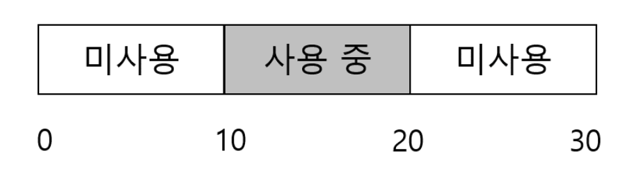
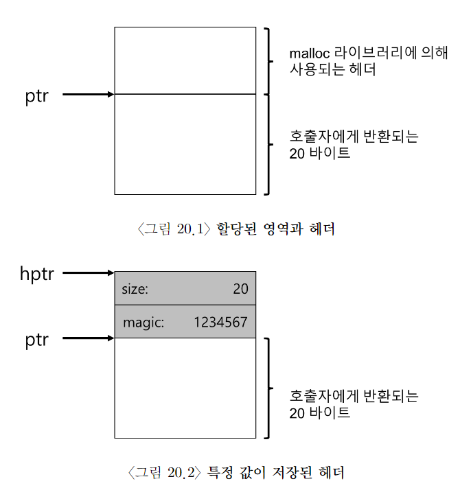
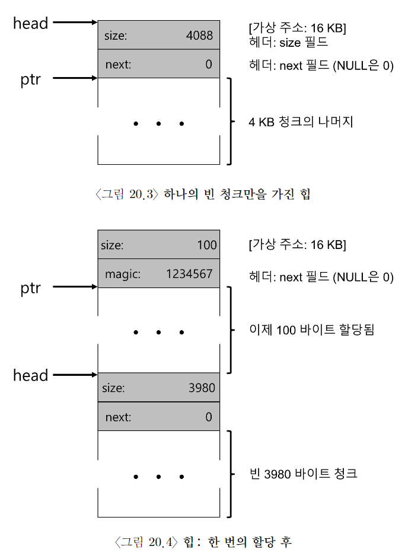
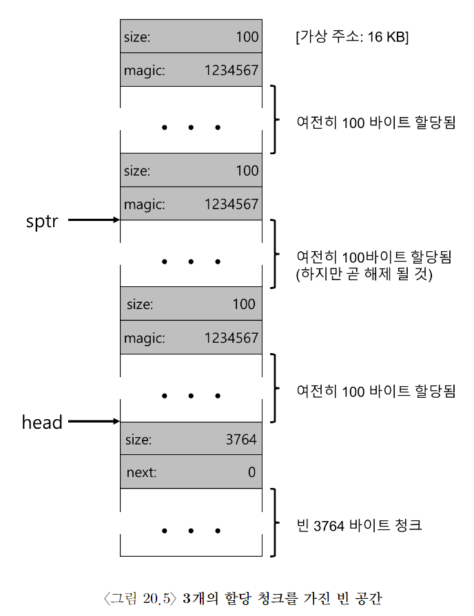
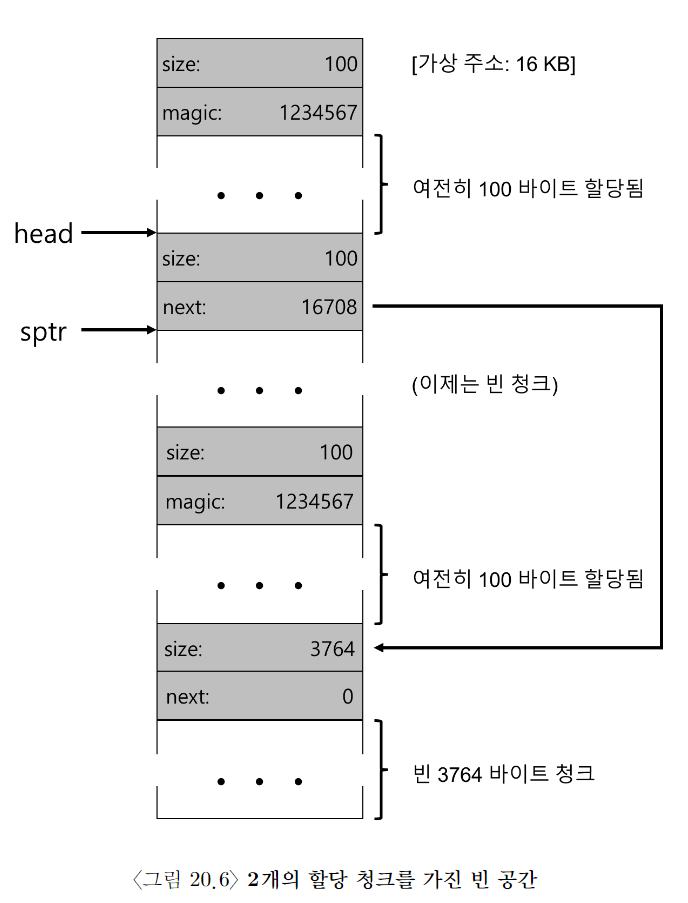

# 빈 공간 관리

## external fragmentation

- 빈 공간이 다양한 크기의 작은 조각으로 분할되어 결국 단편화(fragmentation)된다.
- 빈 공간들의 전체 크기가 요청된 것보다 크더라도 하나의 연속된 영역이 존재하지 않으면 요청 실패 O.

위의 사진 처럼... 남는 공간은 20B인데, 10B 두 조각으로 나위어서 15B 요청이 실패함.

이번 장은 이를 해결하고자 한다.

## 가정

- 사용자 수준 메모리 할당 라이브러리에 존재하는 메모리 할당기의 발전 역사에 초점을 맞춤.

- 이 라이브러리가 관리하는 공간을 heap이라 부름.

- heap의 빈 공간을 관리하는 데는 일반적으로 linked list 사용.

- 내부 단편화 보다는 외부 단편화에 집중

- 할당된 메모리는 다른 위치로 재배치 X.

- 압축(compact) 사용 X.

## 저수준 기법들

- 분할(splitting)과 병합(coalescing)

- 분할: 요청된 메모리 크기 만큼 갉아 먹기
- 병합: 메모리 반환 요청이 생기면, 인접한 빈 청크 주소를 살피고 병합이 가능하다면 병합

### 할당된 공간의 크기 파악

- 대부분의 할당기는 추가 정보를 header 블럭에 저장
- 메모리에 유지, 보통 해제된 청크 바로 직전에 위치

- 사용자가 `free` 연산을 호출하면 라이브러리는 헤더의 시작 위치를 파악하기 위해 간단한 포인터 연산을 한다.

- 헤더를 가리키는 포인터를 얻어 내면, 라이브러리는 매직 넘버가 기대하는 값과 일치하는지 비교하여 sanity check를 실시한다.
- `assert(hptr->magic == 1234567)`
- 그리고 새로 해제된 영역의 크기를 간단한 수학을 통해 계산한다.

