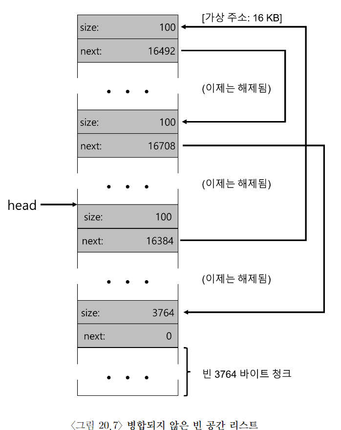
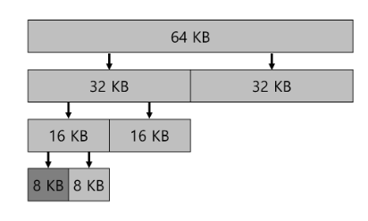

# 빈 공간 관리

## external fragmentation

- 빈 공간이 다양한 크기의 작은 조각으로 분할되어 결국 단편화(fragmentation)된다.
- 빈 공간들의 전체 크기가 요청된 것보다 크더라도 하나의 연속된 영역이 존재하지 않으면 요청 실패 O.

위의 사진 처럼... 남는 공간은 20B인데, 10B 두 조각으로 나위어서 15B 요청이 실패함.

이번 장은 이를 해결하고자 한다.

## 가정

- 사용자 수준 메모리 할당 라이브러리에 존재하는 메모리 할당기의 발전 역사에 초점을 맞춤.

- 이 라이브러리가 관리하는 공간을 heap이라 부름.

- heap의 빈 공간을 관리하는 데는 일반적으로 linked list 사용.

- 내부 단편화 보다는 외부 단편화에 집중

- 할당된 메모리는 다른 위치로 재배치 X.

- 압축(compact) 사용 X.

## 저수준 기법들

- 분할(splitting)과 병합(coalescing)

- 분할: 요청된 메모리 크기 만큼 갉아 먹기
- 병합: 메모리 반환 요청이 생기면, 인접한 빈 청크 주소를 살피고 병합이 가능하다면 병합

### 할당된 공간의 크기 파악

- 대부분의 할당기는 추가 정보를 header 블럭에 저장
- 메모리에 유지, 보통 해제된 청크 바로 직전에 위치

- 사용자가 `free` 연산을 호출하면 라이브러리는 헤더의 시작 위치를 파악하기 위해 간단한 포인터 연산을 한다.

- 헤더를 가리키는 포인터를 얻어 내면, 라이브러리는 매직 넘버가 기대하는 값과 일치하는지 비교하여 sanity check를 실시한다.
- `assert(hptr->magic == 1234567)`
- 그리고 새로 해제된 영역의 크기를 간단한 수학을 통해 계산한다.

## 메모리 할당 과정

## 힙의 확장

힙 공간이 부족한 경우에는?

- 가장 쉬운 방법은 단순히 실패를 반환하는 것.

- 대부분의 전통적인 할당기는 적은 크기의 힙으로 시작하여 모두 소진하면 OS로부터 더 많은 메모리를 요청한다. 할당기는 힙을 확장하기 위해 특정 시스템 콜(ex. `sbrk`)을 호출. 그런 후에 확장된 새로운 영역에에서 새로운 청크를 할당한다.

## 기본 전략

- best fit: 사용자가 요청한 크기랑 가장 비슷한 블럭을 반환. 해당 빈 블럭을 찾기 위해서 overhead가 많이 발생.
- worst fit: best fit가 정반대. 가장 큰 빈 청크를 찾아 요청된 크기 만큼만 반환하고, 남는 부분은 빈 공간 리스트에 계속 유지. 최대한 빈 큰 청크를 남기려고 하는데, 이 역시 항상 빈 공간 전체를 탐색해야 돼서, 엄청난 비용이 발생.
- first fit: 요청보다 큰 첫 번째 블럭을 찾아서 요청만큼 반환한다. 속도가 빠르다는 것이 장점.
- next fit: 항상 리스트의 처음부터 탐색하는 대신 다음 적합 알고리즘은 마지막으로 찾았던 원소를 가리키는 추가 포인터를 유지한다. 빈 공간 탐색을 리스트 전체에 더 균등하게 분산시키는 것. first fit과 성능이 비슷

## 다른 접근 법

- 개별 리스트

특정 응용 프로그램 한두 개가 자주 요청하는 크기가 있다면, 그 크기의 객체를 관리하기 위한 별도의 리스트를 유지하는 것.

- 이진 버디 할당

2^N 크기만큼만 할당해서 되려 내부 단편화로 고생할 수 있다.

