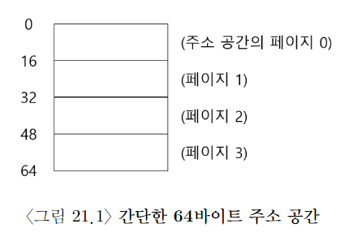
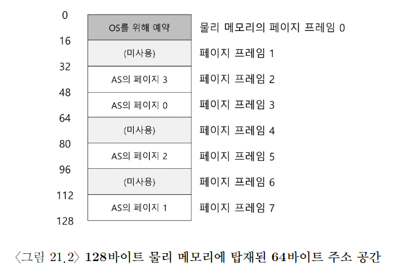

# 페이징

- 프로세스의 주소 공간을 몇개의 가변 크기의 논리 세그먼트(코드, 힙, 스택)로 나누는 게 아니라, 고정 크기의 단위로 나눈다. 이 고정 크기의 단위를 page라고 부른다. 이에 상응해서 물리 메모리도 page frame이라고 불리는 고정 크기의 슬롯의 배열이라고 생각한다.

- 이 프레임은 각각은 하나의 가상 메모리 page를 저장할 수 있다.

## 예제

이런 가상 주소 공간이 있다고 가정하자.
물리 메모리는 아래 그림 처럼 돼 있다. 그리고 가상 주소 공간의 페이지들은 물리 메모리 전체에 분산되어 배치된다. 또, OS가 자기 자신을 위해서 물리 메모리의 일부를 사용하는 것도 보여 준다.

주소 공간의 각 가상 페이지에 대한 물리 메모리 위치 기록을 위해, OS는 프로세스 마다 page table이라는 자료 구조를 유지한다. 페이지 테이블의 주요 역할은 주소 공간의 가상 페이지 주소 변환 정보를 저장하는 것. 각 페이지가 저장된 물리 메모리의 위치가 어디인지 알려준다. 위의 예제 경우,
가상 페이지 0 -> 물리 프레임 3
VP 1 -> PF 7
VP 2 -> PF 5
VP 3 -> PF 2

** page table은 process마다 존재 **

##
