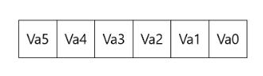
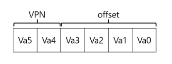
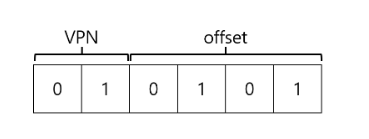
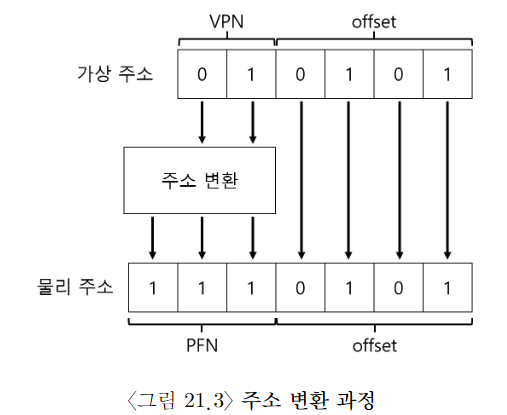
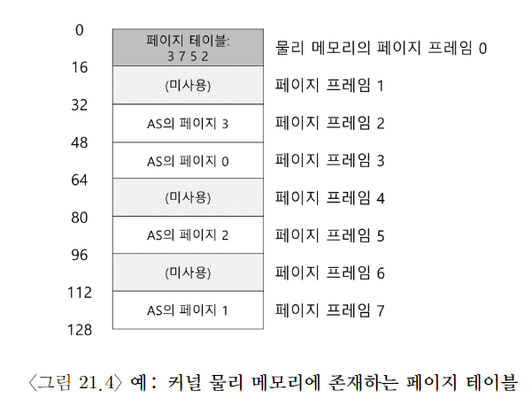
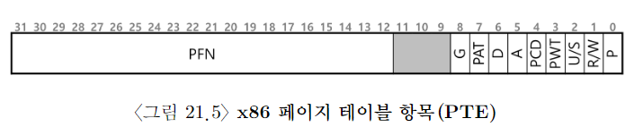
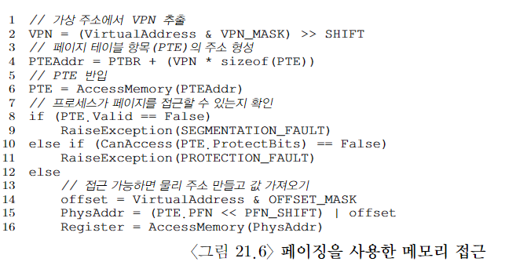

# 페이징

- 프로세스의 주소 공간을 몇개의 가변 크기의 논리 세그먼트(코드, 힙, 스택)로 나누는 게 아니라, 고정 크기의 단위로 나눈다. 이 고정 크기의 단위를 page라고 부른다. 이에 상응해서 물리 메모리도 page frame이라고 불리는 고정 크기의 슬롯의 배열이라고 생각한다.

- 이 프레임은 각각은 하나의 가상 메모리 page를 저장할 수 있다.

## 예제

이런 가상 주소 공간이 있다고 가정하자.
물리 메모리는 아래 그림 처럼 돼 있다. 그리고 가상 주소 공간의 페이지들은 물리 메모리 전체에 분산되어 배치된다. 또, OS가 자기 자신을 위해서 물리 메모리의 일부를 사용하는 것도 보여 준다.

주소 공간의 각 가상 페이지에 대한 물리 메모리 위치 기록을 위해, OS는 프로세스 마다 page table이라는 자료 구조를 유지한다. 페이지 테이블의 주요 역할은 주소 공간의 가상 페이지 주소 변환 정보를 저장하는 것. 각 페이지가 저장된 물리 메모리의 위치가 어디인지 알려준다. 위의 예제 경우,
가상 페이지 0 -> 물리 프레임 3
VP 1 -> PF 7
VP 2 -> PF 5
VP 3 -> PF 2

** page table은 process마다 존재 **

## VPN과 offset bits를 구해 보자

위 예에서는 가상 주소 크기가 64B이기 때문에, 가상 주소는 6bits만 필요.

va5 = msb, va0 = lsb. 우리는 페이지 크기가 16B인 걸 알고 있으니깐, 총 4페이지를 선택할 수 있다. 그래서 msb 2bits가 그 역할을 한다. 나머지 bits는 offset bits라 부른다. offset bits는 페이지 내에서 우리가 원하는 바이트의 위치를 나타냄.

`movl 21, %eax`는 다음과 같이 해석된다.

그리고 가장 주소 21은 가상 페이지 01의 5번째 Byte이다. 이 VPN을 가지고 PFN 혹은 PPN을 찾을 수 있다.

여기서는 VPN 01이 PFN 111로 변한다.offset은 그대로 유지된다.

## page table은 어디에 저장되지?

예를 들어, 4KB 크기의 페이지를 가지는 전형적인 32bits V.A.S를 상상해 보자. 여기서 VPN은 20bits, offset bits는 12bits이다. 각 프로세스를 위해 관리해야 하는 변환의 개수 2^20(약 백만)라는 걸 의미한다.
물로 주소로의 변환 정보와 다른 필요한 정보를 저장하기 위하여 페이지 테이블 항목 (PTE) 마다 4B가 필요하다고 가정하면, 각 페이지 테이블을 저장하기 위해 4MB가 필요하다. 프로세스 100개만 띄워도 400MB를 주소 변환을 위해 쓴다는 말이다. 일단은 물리 메모리에 상주한다고 가정하자.

## page table에는 실제로 무엇이 있는가

page table은 VPN을 PFN으로 매핑하는 데에 사용되는 자료 구조다. linear page table이다. 단순한 배열이다. 일단은 간단한 선형구조를 사용한다고 가정한다.

각 PTE에는 심도 있게 이해가 필요한 비트들이 존재한다.

- valid bit는 특정 변환의 유효 여부를 나타내기 위하여 포함된다. 프로그램이 실행을 시작할 때, 코드와 힙이 주소 공간 한쪽에 있고, 반대에는 스택이 있을 거다. 그 사이의 모든 미사용 공간은 invalid로 표시된다. 프로세스가 그런 메모리를 접근하려고 하면 OS에서 trap을 발생시킨다. OS는 그런 프로세스를 종료시킬 확률이 높다. valid bit는 할당되지 않은 VAS를 표현하기 위해 반드시 필요하다.

- 페이지가 읽을 수 있는지, 쓸 수 있는지, 또는 실행될 수 있는지를 표시하는 protection bit가 있다. Protection bit가 허용하지 않는 방식으로 페이지에 접근하려 하면 OS에 trap을 생성한다.

- Present bit는 이 페이지가 물리 메모리에 있는지 혹은 disk에 있는지 가리킨다. (즉, swap out 되었는지)

- dirty bit는 메모리에 반입된 후에 페이지가 변경되었는지 여부를 나타낸다.

- reference bit는 때떄로 페이지가 접근되었느지를 추적하기 위해 사용된다. 또한, 어떤 페이지가 인기가 있는지 결정하여 메모리에 유지되어야 하는 페이지를 결정하는 데에도 유용하다.

위의 그림을 참조 하자.

## 페이징: 너무 느림

페이지 테이블의 크기가 메모리 상에서 매우 크게 증가할 수 있다. 페이지 테이블로 인해 처리속도가 저하될 수 있다.

`movl 21, %eax`

이 예에서는 하드웨어가 주소 변환을 담당한다고 가정하자. 원하는 데이터를 가져오기 위해서는, 먼저 시스템은 가상 주소(21)를 정확한 물리 주소(117)로 변환해야 한다. 주소 117에서 데이터를 반입하기 전에 시스템은 프로세스의 페이지 테이블에서 PTE를 가져와야 하고, 변환을 수행한 후에 물리 메모리에서 데이터를 탑재한다. 이렇게 하기 위해서 하드웨어는 현재 실행 중인 프로세스의 page table 위치를 알아야 한다. page table base register가 페이지 테이블의 시작 주소(물리 주소)를 저장한다고 가정한다. 원하는 PTE의 위치를 찾기 위해 하드웨어는 다음과 같은 연산을 수행한다.

`VPN = (VirtualAddress & VPN_MASK) >> SHIFT`
`PTEAddr = PageTableBaseRegister + (VPN * sizeof(PTX))`

1. 전체 가상 주소에서 vpn_mask로 vpn 비트만 골라낸다. 그리고 shift로 bit를 움직인다. (정수 가상 페이지 번호를 형성하려고)
2. 우리는 1의 값을 PTE 배열에 대한 index로 사용한다.

위와 같은 과정을 거쳐서 물리 주소가 알려지면, 하드웨어는 메모리에서 PTE를 가져오고, PFN을 추출하고, 가상 주소의 오프셋과 연결하여 원하는 물리 주소를 만든다.

`offset = VirtualAddress & OFFSET_MASK`
`PhysAddr = (PFN << SHIFT) | offset`
을 통해서 최종 주소를 형성한다고 생각할 수 있다. 마지막으로 이제 하드웨어는 메모리에서 원하는 데이터를 가져와서 eax 레지스터에 넣을 수 있다.

eax 레지스터에 메모리 값 넣겠다고 일어나는 일들이다. 엄청난 양의 작업이다.

## 메모리 트레이스
