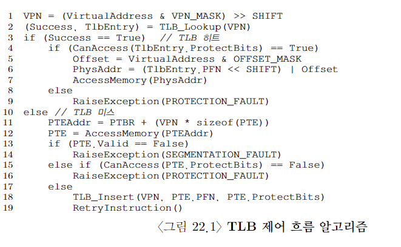
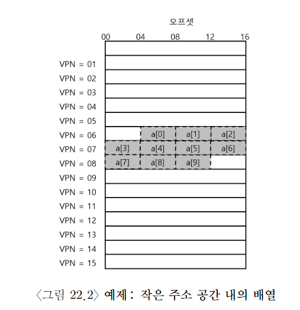

# 페이징: 더 빠른 변환 (TLB)

- 주소 변환을 빠르게 하기 위해서 우리는 translation-lookaside buffer 또는 TLB라고 부르는 것을 도입한다.

- TLB는 칩의 메모리 관리부 (memory-management unit, mmu)의 일부이다.

- 자주 참조되는 가상 주소-실주소 변환 정보를 저장하는 하드웨어 cache이다.

- address-translation cache가 좀 더 적합한 명칭이다.

- 가상 메모리 참조 시, 하드웨어는 먼저 TLB에 원하는 변환 정보가 있는지 확인한다. 있으면 page table을 통하지 않고 변환을 빨리 수행한다.

## TLB의 기본 알고리즘



위 그림은 TLB 제어 흐름 알고리즘을 보여주고 있다.

하드웨어 부분의 알고리즘은 다음과 같이 동작한다.

1. VA에서 VPN을 추출하고
2. VPN의 TLB 존재 여부를 검사한다.

```
if TLB hits:
   PFN 추출
   if Cacn Access tlb protectbits:
    PA 구성
```

만약에 TLB miss가 일어나면 할 일이 많다. 원래 알던 대로 페이지 테이블에 접근하며, 프로세스가 생성한 가상 메모리 참조가 유효하고 접근이 가능하다면, 해당 변환 정보를 TLB로 읽어 들인다.

## 예제: 배열 접근

TLB 작동 과정을 좀 더 명확히 보자.



8bits V.A.S, page 크기: 16B, VPN: 4bits, offset: 4bits

```c
int sum = 0;
for (i = 0; i < 10; i++>) sum += a[i];
```

의 코드를 보자.

a[0]: VA 100번이다.

하드웨어는 VPN을 추출한다. VPN은 06번이다. 하드웨어는 TLB에서 해당 VPN을 검색한다. TLB가 초기화 돼 있다고 가정한다. 첫 접근이다. TLB miss가 발생. 미스가 발생하면 해당 VPN 06번에 대한 PFN를 찾아, TLB를 갱신한다.
그 다음은 a[1]을 읽는다. a[1]을 읽을 때에는 상황이 좋다. TLB hit다. 배열의 두번째 항목은 첫 번째 항목과 같은 page에 존재한다. 첫 번째 항목을 읽을 때, 이미 해당 페이지를 접근했기 때문에, 필요한 변환 정보가 이미 TLB에 탑재 돼 있다.
근데 a[3]는 상황이 안 좋다. TLB미스다.
계속 이런 식으로 정리해 보면, TLB hit ratio는 70%나 된다. spatial locality으로 인해서 성능을 개선할 수 있었다.
TLB 성능에 관한 마지막 주요 사항이다. 위의 예제 프로그램이 루프 종료 후에도 배열을 사용한다면 성능은 더욱 개선된다. 모든 주소 변환 정보가 TLB에 탑재되어 있기 때문이다. TLB가 모든 주소 변환 정보를 저장할 정도로 충분히 크다면 hit, hit, hit... 이 경우에는 temporal locality으로 인해 TLB 히트율이 높아진다.

## TLB miss는 누가 처리할까

1. CISC -> 하드 웨어
2. RISC -> 소프트 웨어 (OS)

## TLB의 구성: 무엇이 있나?

VPN | PFN | 다른 비트들(valid, prot, ASID 등등)

TLB는 fully-associated cache이다.

## TLB의 문제: 문맥 교환

1. 그냥 TLB를 비운다.
2. ASID 필드를 추가한다.

## 이슈: 교체 정책

1. LRU
2. 랜덤

## 실제 TLB
