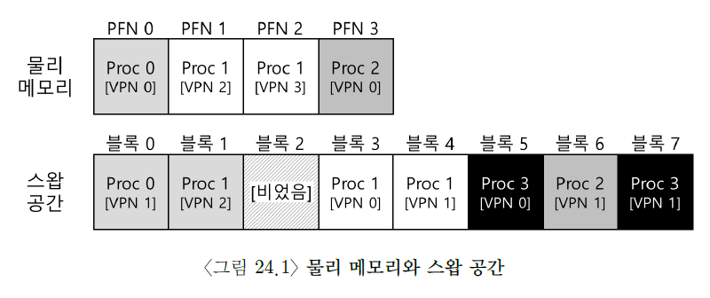
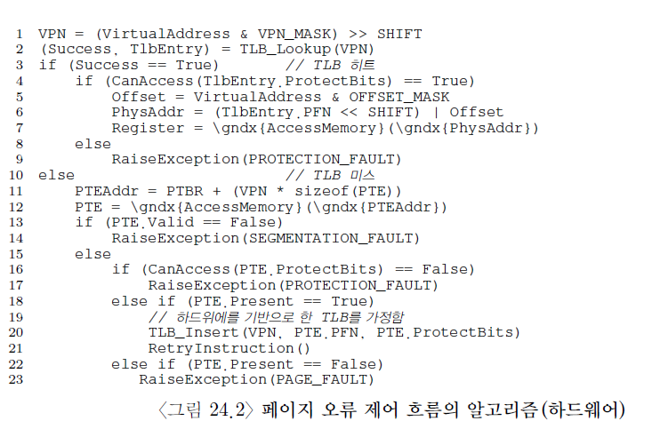
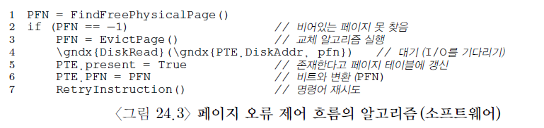

# 물리 메모리 크기의 극복: 메커니즘

- 지금까지 V.A.S가 비현실적으로 작다고 가정했고, 모두 물리 메모리에 탑재가 가능한 것으로 가정했다.

- 이제 그 가정을 완화한다. 다수의 process들이 동시에 각자 큰 V.A.S를 사용하고 있는 상황을 가정한다.

- 이를 위해, 메모리 계층에 새로운 layer 추가가 필요하다. 지그까지 모든 page들이 물리 메로리에 있다고 가정. 하지만 큰 V.A.S를 지원하기 위해서 OS는 V.A.S 중에서 현재 크게 필요하지 않은 일부를 보관해 둘 필요가 있고, 그것은 HDD(하드 디스크 드라이브).

## OS는 어떻게 크고 느린 장치를 사용하면서 마치 커다란 V.A.S가 있는 것처럼 할 수 있을까?

- 한 가지 짚고 넘어가야 할 것은 왜 process들에게 굳이 큰 V.A.S를 줘야하는 것이다.

- 이 질문에 대한 답은 "편리함"과 "사용 용이성"이다.

- V.A.S가 충분히 크면, 프로그램의 자료 구조들을 위한 충분한 메모리 공간이 있는지 걱정하지 않아도 된다.

- 프로그램은 필요할 때마다, OS에게 메모리 할당을 요청하면 그만이다.

- OS가 이러한 가상환경을 제공하면, 인생이 편해진다(?)

- 이와 대비되는 기법으로 옛날 시스템에 사용되던 memory overlay가 있다. 직접 수동으로 메모리에 탑재/제거했다. (헉)

- swap 공간이 추가되면 OS는 각 process들에게 큰 V.A.S가 있는 것 같은 환상을 줄 수 있다.

- 멀티프로그래밍 시스템이 나오면서, 많은 process들의 페이지를 물리 메모리에 전부 저장하는 게 불가능해졌다.

- 그래서, 일부 페이지들을 스왑 아웃하는 기능이 필요하게 됐다. 멀.프와 사용 편의성 등의 이유로 실제 메모리보다 더 많은 용량의 메모리가 필요하게 됐다. 이게 현대 Virtual Memory의 역할이다.

# 스왑 공간

- 가장 먼저할 일은 디스크에 페이지들을 저장할 공간을 확보하는 것이다.

- 이 용도의 공간을 swap space라 한다.

- 스왑 공간이라고 불리는 이유: 메모리 페이지를 읽어서 이곳에 쓰고(swap out), 여기서 페이지를 읽어 메모리에 탑재시키기(swap in)때문이다.

- swap space의 I/O 단위는 page이다.

- OS는 swap space에 있는 모든 page들의 디스크 주소를 기억해야 한다.

- swap space의 크기는 매우 중요하다. 왜냐면 시스템이 사용할 수 있는 memory apge의 최대수를 결정하기 때문.

- 일단은 스왑 공간이 매우 크다고 가정

## 예제

- 물리 메모리와 swap space에는 각각 4개의 페이지와 8개의 페이지를 위한 공간이 존재

- Proc 0, Proc 1, Proc 2가 물리 메모리를 공유.

- 세 process는 몇 개의 유효한 페이지들만 메모리에 올려 놓았음.

- 나머지 page들은 디스크에 swap out돼 있다.

- 네 번째 process인 Proc 3의 모든 page들은 디스크로 swap out 되어 있기 때문에, 현재 실행 중이 아닌 게 분명한 상태.

- swap space에 하나의 블럭이 비었다. 위 예제를 통해 swap space를 이용하면, 시스템에 실제 물리적으로 존재하는 메모리 공간보다 더 많은 공간이 존재하는 것처럼 가장할 수 있다.

- swap space에만 swap을 할 수 있는 게 아니다.

- 예를 들어, 프로그램을 실행한다고 하자. (`ls` 혹은 내가 컴파일한 `main` 프로그램)

- 이 프로그램의 페이지들은 디스크에 존재한다.

- 프로그램이 실행되면 각 페이지들은 메모리로 탑재된다. (한 번에 모두 탑재되거나, 필요 시 한 페이지씩 탑재할 수 있다.)

- 물리 메모리에 추가 공간을 확보해야 할 때, 코드 영역의 페이지들이 차지하는 물리 페이지는 즉시 딴 페이지가 사용할 수 있다. 코드가 저장되어 있는 파일 시스템 영역이 스왑 목적으로 사용되는 셈이다. 해당 페이지들은 디스크에 원본이 있어서, 언제든지 swap in이 가능하기 때문이다.

# Present Bit

- disk에 swap space를 확보했으니, 이제 page swap을 위한 기능을 다룰 차례이다. 하드웨어 기반의 TLB를 사용하는 시스템을 가정하자.

- 먼저 메모리가 참조되는 과정을 상기하자. process가 가상 메모리 참조를 생성한다. (명령어 탑재나 데이터 접근). 하드웨어는 메모리에서 원하는 데이터를 가져오기 전에, 우선 가상 주소를 물리 주소로 변환한다.

- hardware는 virtual address에서 VPN을 추출한 후에 TLB에 해당 정보가 있는지 검사한다. (TLB Hit). 만약 hit가 되면 물리 주소를 얻은 후에 메모리로 가져 온다.

- 만약 VPN을 TLB에서 찾을 수 없다면(TLB Miss), 하드웨어는 페이지 테이블의 메모리 주소를 파악(페이지 테이블 베이스 레지스터 사용)하고, VPN을 index로 하여 원하는 PTE를 추출한다. 해당 PTE가 유효하고, 관련 page가 physical memory에 존재하면, hardware는 PTE에서 PFN 정보를 추출하고, 그 정보를 TLB에 탑재한다. TLB 탑재 후 명령어를 재실행한다. 이번에는 TLB에서 hit된다.

- 근데 여기서 page가 disk로 swap되는 것을 가능케 하려면, 많은 기법들이 추가돼야 한다.

- 특히, hardware가 PTE에서 해당 page가 physical memory에 존재하지 않는다는 것을 표현해야 한다. hardware는 present bit를 사용해, 각 PTE에서 어떤 page가 존재하는지를 표현한다.

- present bit가 set돼 있으면, physical memory에 해당 page가 존재한다는 것이고, 위에 설명한 대로 동작한다.

- present bit가 set돼 있지 않으면, 메모리에
  해당 page가 없고, disk 어딘가에 존재한다는 것을 말한다.

- physical memory에 존재하지 않는 page를 접근하는 행위를 page fault라고 한다

- page fault가 발생하면, page fault를 처리하기 위해 OS로 제어권이 넘어 간다. page-fault handler가 실행된다.

# 페이지 폴트

- page fault가 발생하면, OS가 그 처리를 담당한다.

- OS의 page fault handler가 그 처리 메커니즘을 규정한다.

- 만약 요청된 page가 physical memory에 없고, disk로 swap out됐다면, OS는 해당 page를 memory로 swap in 해온다.

- 그렇다면 원하는 page의 위치를 어떻게 파악할까?

- 많은 시스템들에서 해당 정보 - 즉 해당 페이지의 swap space에서의 위치 -를 page table에 저장한다.

- OS는 PFN과 같은 PTE비트들을 page의 disk 주소를 나타내는 데에 사용할 수 있다. page fault 시, OS는 PTE에서 해당 page의 disk 상 위치를 파악하여, 메모리에 탑재한다.

- disk I/O가 완료되면, OS는 해당 PTE의 PFN 값을 탑대된 page의 메모리 위치로 갱신한다.

- 이 작업이 안료되면 page fault를 발생시킨 명령어가 재실행된다. 재실행으로 인해 TLB miss가 발생될 수 있다. TLB miss 처리 과정에서 TLB 값이 갱신된다.

- 최정적으로 마지막 재실행 시, TLB에서 주소 변환 정보를 찾게 되고, 이를 이용해 physical address에서 원하는 데이터나 명령어를 들고 온다.

- I/O 전송 중에는 해당 process가 blocked 상태가 된다는 것을 유의해야 한다. page fault 처리 시 OS는 다른 process들을 실행할 수 있다. I/O 실행은 매우 시간이 많이 소요되기 때문에, 한 process의 I/O 작업(page fault)과 다른 process의 실행을 overlap 시키는 것은 multi programmed된 system에서 hardware를 최대한 효율적으로 사용하는 방법 중 하나다.

# 메모리에 빈 공간이 없으면?

- 위 설명에서, swap space로부터 page를 가져오기 위한 (page-in), 여유 메모리가 충분하다는 것을 가정했다. 항상 이런 경우만 있는 것은 아니다.

- 메모리에 여유 공간이 없을 수 있다. (또는 거의 다 찼거나)

- 탑재하고자 하는 새로운 page들을 위한 공간을 확보하기 위해서, 페이지들을 먼저 page out하려고 할 수도 있다. replace 페이지를 선택하는 것을 page-replacement policy라고 한다.

# 페이지 폴트의 처리

- 위 그림은 hardware를 통한 주소 변환을 나타낸다. 아래 그림은 page fault 발생 시 OS의 동작을 나타낸다.

- 먼저 OS는 탑재할 page를 위한 물리 프레임을 확보한다. 만약 여유 프레임이 없다면, 교체 알고리즘을 실행하여 메모리에서 페이지를 내보내고 페이지를 읽어 온다.

- 마지막으로 이 느린 작업이 완료되면 OS는 page table을 갱신하고 명령어를 재시도한다. 재시도 하면 tlb miss 발생, 또 한번 재시도를 할 때 tlb hit가 된다. 그제서야 hardware는 원하는 것을 접근할 수 있게 된다.

# 교체는 실제로 언제 일어나는가

- 다양한 이유로 인해, OS는 항상 어느 정도 여유 메모리 공간을 확보하고 있어야 한다.

- OS는 여유 공간에 관련된 high watermark와 low watermak를 설정하여 교체 알고리즘 작동에 활용한다.

- 동작 방식은 다으모가 같다.

- OS가 여유 공간의 크기가 최솟값보다 작아지면 여유 공간 화곱를 담당하는 background thread가 실행된다. 이 thread는 여유 공간의 크기가 최댓값에 이를 때까지 페이지를 제거한다. 이 background thread는 일반 적으로 swap daemon 혹은 page deamon으로 불린다.

- 충분한 여유 메모리가 확보되면, 이 background thread는 sleep mode로 들어간다.

- 일시에 여러 개를 교체하면 성능 개선이 가능하다.

- 많은 시스템들은 다수의 page들을 cluster나 group으로 묶어서 한 번에 스왑 파티션에 저장함으로써 디스크의 효율을 높인다.
