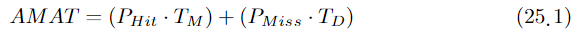
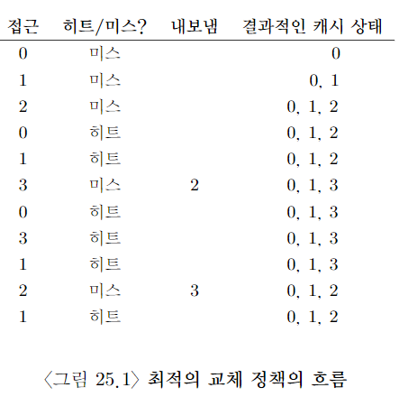
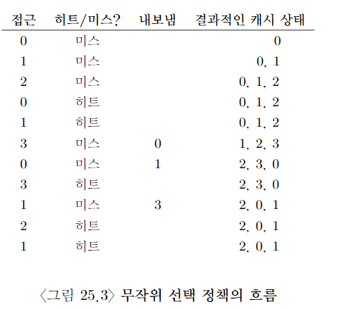
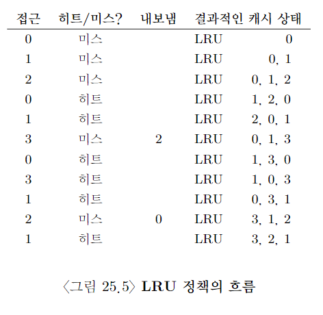
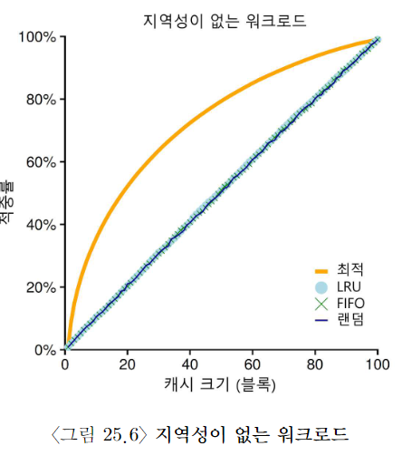
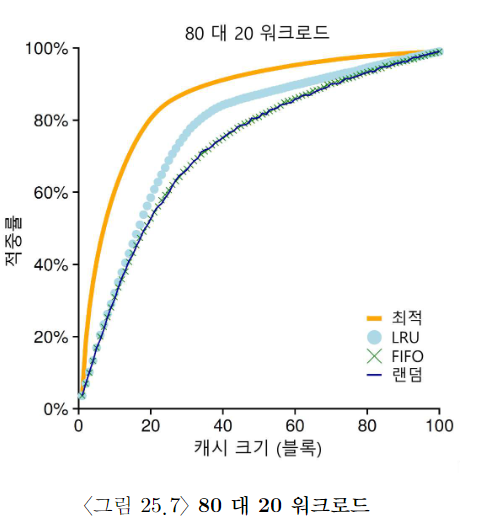
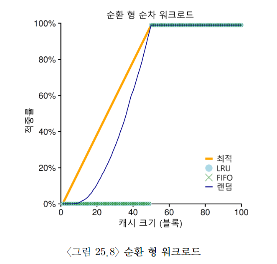
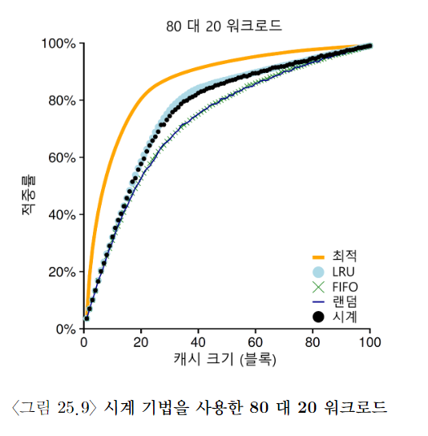

# 물리 메모리 크기의 극복: 정책

- 가상 메모리 관리자의 입장에서 비어 있는 메모리가 많을수록 일은 쉬워진다. page fault가 발생하면 빈페이지 리스트에서 비어 있는 페이지를 찾아서, page fault를 일으키 page에게 할당하면 된다.

- 불행히도, 빈 memory 공간이 거의 없으면 일이 복잡해진다. 그런 경우 OS는 memory pressure를 해소하기 위해 다른 페이즈들을 강제적으로 paging out하여 활발히 사용 중인 페이지들을 위한 공간을 확보한다.

- evict page 선택은 OS의 replacement policy안에 집약돼 있다.

# 캐시 관리

- 메인 메모리는 system의 가상 메모리 page를 가져다 놓기 위한 cache로 생각될 수 있다.

- 이 캐시를 위한 교체 정책의 목표는 cache miss의 횟수를 최소화하는 것이다.

- 즉, disk로부터 page를 가져오는 횟수를 최소로 만드는 것이다. 한편으로 cache hit 횟수를 최대로 하는 것도 목표라고 할 수 있다. 즉, 접근된 페이지가 메모리에 이미 존재하는 횟수를 최대로 하는 것이다.

- cache hit와 miss의 횟수를 안다면 프로그램의 average memory access time, AMAT을 계산할 수 있다.

- 여기서부터는 너무 복잡하니깐, 책 보셈. 여기다가 정리하는 것보다 책 보는 게 나을 듯. (대충 아주 작은 미스가 발생하더라도 AMAT 큰 영향을 주니깐, 최대한 미스를 줄여야 한다는 얘기임)

# 최적 교체 정책

- 최적 교체 정책은 이미 개발됐다. 최적 교체 정책은 miss를 최소화한다. 가장 나중에 접근될 페이지를 교체하는 것이 최적이며, 가장 적은 횟수의 miss를 발생시킨다는 걸 증명했다. 간단하지만은 구현하기는 매우 어려운 정책이다.

- 만약 페이지 하나를 내보내야 한다면, 지금부터 가장 먼 시점에 필요하게 될 page를 버리는 게 좋지 않을까? 핵심은 가장 먼 시점에 필요한 페이지보다 캐시에 존재하는 다른 페이지들이 더 중요하다는 것이다.

- 간단한 예제를 보자. 프로그램이 0, 1, 2, 0, 1, 3, 0, 3, 1, 2, 1의 순서대로 가상 페이지들을 접근한다고 가정하자. 캐시에 이 세 개의 페이지를 저장할 수 있다고 가정할 때, 그림 25.1은 최적의 기법의 동작을 보여준다.

- 캐시는 처음에 비어 있는 상태로 시작하기 때문에, 첫 세 번의 접근은 당연히 미스이다. 이러한 종류의 미스는 cold-start miss 또는 compulsory miss라고 한다.

- 그 다음에 page 0과 1을 참조하면 cache hit된다. 마지막으로 또 다른 miss를 만나게 된다. 근데 이때는 cache가 가득 차있기 때문에 replacement policy가 실행돼야 한다.

- 이때 다음과 같은 질문이 나온다. "어떤 페이지를 교체해야 할까?"

- 최적의 기법은 각 프로세스 별로 미래를 봐서, 히트율을 최대로 높인다는 것이다. 근데 현실은 그렇지 않다. 미래를 어캐 봄?

# FIFO

- first in first out, 선입 선출

- 최적의 경우와 비교하면 FIFO는 눈에 띄게 성능이 안 좋다. 히트율은 36.4%가 된다.

- FIFO는 블럭들의 중요도를 판단할 수가 없다. 페이지 0이 여러 차례 접근이 됐더라도, 단순히 memory에 먼저 들어왔다는 이유로 FIFO는 페이지 0을 내보낸다.

# 무작위 선택

- 무작위 선택 정책은 FIFO보다 약간 더 좋은 성능을 보이며, 최적의 방법보다는 약간 나쁜 성능을 보인다.

# LRU

- page replacement policy이 활용할 수 있는 과거 정보 중 하나는 frequency이다. 만약 한 페이지가 여러 차례 접근됐다면, 분명히 어떤 가치가 있기 때문에 교체되면 안될 것이다.

- 좀 더 자주 사용되는 페이지의 특징은 접근의 recency이다. 더 최근에 접근된 페이지일수록 가까운 미래에 접근될 확률이 높다.

- 이러한 류의 정책은 principle of locality라고 부르는 특성에 기반을 둔다. 이 원칙이 말하는 건 단순하다. 프로그램들은 특정 코드들과 자료구조를 상당히 빈번하게 접근하는 경향이 있다.

- 그리하여 과거 이력에 기반한 replacement algorithm이 탄생했다. LFU와 LRU.

- 위 예제에서는 LRU가 최적 기법과 같은 정도 수준의 성능을 얻을 수 있는 최고의 결과를 보여주고 있다.

# 워크로드에 따른 성능 비교

- 첫 번째 살펴볼 워크로드에서는 지역성이 없다. 그 말은 접근되는 페이지들의 집합에서 페이지가 무작위적으로 참조된다는 것을 의미한다. 이 예제에서는 페이지들이 일정 시간 동안 계속 접근하는 워크로드를 사용한다.

- 접근되는 페이지는 무작위적으로 선택되며, 페이지들이 총 10,000번 접근된다. 실험에서는 캐시의 크기를 매우 작은 것부터(한 페이지)부터 모든 페이지들을 담을 수 있을 정도의 크기까지(100페이지) 증가시켰으며, 이를 통해 각 정책이 캐시 크기에 따라 어떻게 동작하는지 살펴봤다.

- 워크로드에 지역서잉 없다면 어느 정책을 사용하든 상관이 없다.

- 다음으로 살펴볼 워크 로드는 "80 대 20" 워크로드이다. 20%의 페이지들에서(인기 있는 페이지) 80%의 참조가 발생하고, 나머지 80%의 페이지들에 대해서 20%의 참조만(비인기 페이지) 발생한다. 이 워크로드도 마찬가지로 총 100개의 페이지들이 있다. 인기 있는 페이지들에 대한 참조가 실험 시간의 대부분을 차지.

- 인기 있는 페이지들을 캐시에 더 오래두는 경향이 있는 LRU가 더 좋은 성능을 보인다.

- 마지막으로 하나의 워크로드를 더 살펴보자. 이 워크로드는 순차 반복 워크로드라고 부른다. 이 워크로드는 50개의 페이지들을 순차적으로 참조한다. 0번 페이지를 참조하고, 1번을 참조하고 ... 49번째의 페이지를 참조한 후에 다시 처음으로 돌아가서 그 접근 순서를 반복한다. 50개의 개별적인 페이지들을 10,000번 접근한다.

- LRU와 FIFO에서 가장 안 좋은 성능을 보인다.

- 워크로드의 반복적인 특성으로 인해서, 오래된 페이지들은 정책들이 캐시에 유지하려고 선택한 페이지들보다 먼저 접근된다. 캐시 크기가 49라고 할지라도, 50개의 페이지들을 순차 반복하는 워크로드에서는 캐시 hit rate가 0%가 된다.

# 과거 이력 기반 알고리즘의 구현

- 대체 페이지마다 과거 이력을 성능 저하 없이 기록할까?

- 약간의 hardware 지원을 받는 것이다. 예를 들어 페이지 접근이 있을 때마다 하드웨어가 메모리의 시간 필드를 갱신하도록 할 수 있다.

- 이렇게 하여 페이지가 접근되면 하드웨어가 시간 필드를 현재 시간으로 설정한다. 페이지 교체 시 OS는 가장 오래 전에 사용된 페이지를 찾기 위해 시간 필드를 검사한다.

- 시스템의 페이지 수가 증가하면 페이지들의 시간 정보 배열을 검색하여 가장 오래전에 사용된 페이지를 찾는 것은 매우 고비용의 연산이 된다.

- 꼭 오래된 페이지를 찾아야 할까? 대신 비슷하게 오래된 페이지를 찾아도 되지 않을까?

# LRU 정책 근사하기

- LRU를 근사하는 방식을 구현하려면, use bit라는 약간의 하드웨어 지원이 필요하다.

- 시스템의 각 page마다 하나의 use bit가 있으면, 이 use bit는 메모리 어딘가에 존재한다. (구현에 따라 process마다 가지고 있는 page table에 있을 수도 있고, 또는 어딘가에 array 형태로 존재할 수도 있다.)

- page가 참조될 때마다 (즉, 읽히거나 기록되면), hardware에 의해서 use bit가 1로 설정된다. 하드웨어는 이 비트를 절대로 지우지 않는다. (즉, 0으로 set하지 않는다.). 0으로 set하는 건 OS의 몫이다.

- OS는 LRU에 가깝게 구현하기 위해서 use bit를 어떻게 활용할까?

- clock algorithm에서 간단한 활용 방법이 제시 됐다.

- 시스템의 모든 페이지들이 환형 리스트를 구성한다고 가정.

- clock hand가 특정 페이지를 가리킨다고 해 보자. (어떤 게 돼도 상관 없다.)

- 페이지를 교체해야 할 때, OS는 현재 clock hand가 가리키고 있는 페이지 P의 use bit가 1인지 0인지 검사.

- 만약 1이면, page P는 최근에 사용됐으며 바람직한 교체 대상이 아니다.

- P의 use bit는 0으로 설정되고(지워짐), clock hand는 다음 페이지 P + 1로 이동.

- 알고리즘은 use bit가 0으로 설정돼 있는, 즉 최근에 사용된적이 없는, page를 찾을 때까지 반복된다. (최악의 경우에는 모든 페이지들이 사용된 적이 있어서, 모든 페이지들을 탐색하면서 use bit를 전부 0으로 설정해야 될 수도 있음.)

- 이 방법 외에도 use bit를 사용하여 LRU를 근사하는 다른 방법들이 존재한다. 주기적으로 use bit를 지우고, replacement page 선택을 위해 use bit가 1과 0인 페이지를 구분할 수 있으면 된다.

- 변형된 시계 알고리즘의 동작이 아래의 그림에 나와 있다. 이 변형 방식은 교체할 때 페이지들을 랜덤하게 검사한다. reference bit가 1로 설정되어 있는 만나게 되면 비트를 지운다(0으로 설정한다.). reference bit가 0으로 설정돼 있는 페이지를 만나면 그 페이지를 교체 대상으로 선정한다.

# 갱신된 페이지(dirty page)의 고려

- 만약에 어떤 page가 modified돼, dirty 상태가 됐다면, 그 page를 내보내기 위해서는 디스크에 변경 내용을 기록해야 되기 때문에 비싼 비용을 지불해야 한다.

- 만약 변경되지 않았다면(즉, clean 상태), 내보낼 때 추가 비용이 없다. 해당 page frame은 추가적인 I/O 없이 다른 용도로 재사용될 수 있다.

- 그래서 어떤 VM 시스템들은 dirty한 page들 대신에 clean page를 내보내는 걸 선호한다.

- 이와 같은 동작을 지원하기 위해서 hardware는 modified bit(dirty bit)를 지원해야 한다. page가 modified될 때마다 bit가 1로 설정되므로 page 교체 알고리즘에서 이를 고려하여 교체 대상을 선정한다.

- 예를 들어, 시계 알고리즘은 교체 대상을 선택할 때, 사용되지 않고, clean한, 두 조건을 모두 만족하는 페이지를 먼저 찾도록 수정된다. 이 조건을 만족시키는 page를 찾는 데에 실패하면, 수정됐지만 한동안 사용 안된 page를 찾는다.

# 다른 VM 정책들

- 페이지 교체 정책만이 VM 시스템이 채택하는 유일한 정책은 아니다.

- 예를 들어, OS는 언제 page를 메모리로 불러들일지 결정해야 한다.

- page selection 정책이라고 불린다.

- OS는 대부분의 page를 읽어 들일 때, demand paging 정책을 사용한다.

- 말 그대로 요청된 후 즉시, 즉 페이지가 실제로 접근될 때 OS가 해당 page를 memory로 읽어 들인다.

- OS는 어떤 page가 곧 사용될 것이라는 것을 대략 예상할 수 있기 때문에, 미리 memory로 읽어 들인다. 이와 같은 동작을 prefetching이라고 하며, 성공할 확률이 충분히 높을 때에만 해야 한다.

- 또 다른 정책은 운영체제가 변경된 페이지를 디스크에 반영하는 데 관련된 방식이다.

- 한 번에 한 page씩 disk에 쓸 수 있지만, 많은 system들은 기록해야 될 page들을 memory에 모은 후, 한 번에 disk에 기록한다.

- 이와 같은 동작은 clustering 또는 grouping of writes라고 부른다.

# 쓰래싱(Thrashing)

- 메모리 사용 요구가 감당할 수 없을 만큼 많고, 실행 중인 process가 요구하는 메모리가 가용 물리 메모리 크기를 초과하는 경우 os는 어떻게 해야 하는가?

- 이런 경우 system은 끊임없이 paging을 할 수밖에 없고, 이 상황을 thrashing이라고 한다.

- 옛날: 일부 프로세스를 실행 중지 시킨다. 실행되는 프로세스의 수를 줄여서, 나머지 프로세스를 모두 메모리에 탑재하여 실행하기 위해서이다. working set이란 process가 실행 중에 일정 시간 동안 사용하는 페이지들의 집합이다. admission control이라고 알려져 있는 이 방법은 많은 일들을 엉성하게 하는 것보다는 더 적은 일을 제대로 하는 것이 나을 때까 있다고 말한다.

- 최신: out-of-memory killer, 이 데몬은 많은 메모리를 요구하는 프로세스를 골라 죽인다.
