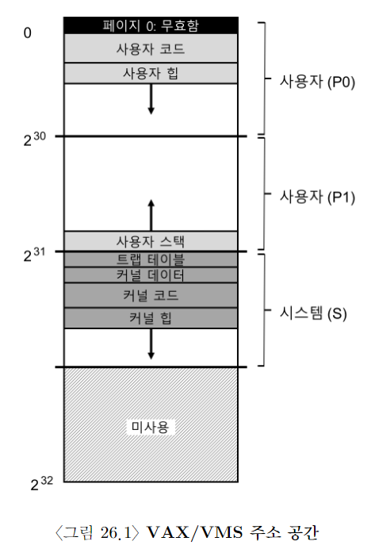

# VAX/VMS 가상 메모리 시스템

가상 메모리에 대한 학습을 마치기 전에, VAX/VMS OS의 잘 만들어진 가상 메모리 관리자에 대해 상세히 살펴 보자. 이전에 살펴봤던 몇 가지 개념들이 완전한 메모리 관리자 내에서 어떤 식으로 적용됐는지 설명할 것이다.

# 메모리 관리 하드웨어

- VAX-11: 프로세스마다 512B page 단위로 나눠진 32bit V.A.S를 제공ㄴ

- V.A는 23bit VPN와 9bit offeset으로 구성됐다.

- VPN의 상위 두 bit는 page가 속한 segment를 나타내기 위해서 사용됐다.

- 이 시스템은 앞서 살펴봤던 paging과 segmentation의 hybrid 구조를 갖고 있다.

- 주소 공간의 하위 절반은 프로세스 공간으로 알려져 있으며 각 프로세스마다 다르게 할당된다.

- 프로세스 공간의 첫 번째 절반(po)은에 사용자 프로그램과 heap이 존재한다.

- heap은 주소가 큰 쪽으로 증가한다

- 프로세스 공간의 두 번째, 즉 큰 쪽 절반(p1)은 주소가 작은 방향으로 증가하는 stack이 존재한다.

- 주소 공간의 상위 절반은 그 중 반만 사용되며 시스템 공간(S)으로 불린다.

- OS의 보호된 코드와 데이터가 이곳에 존재하며, 이 방식으로 여러 프로세스가 OS를 공유한다.

- VMS 설계자들의 주요 고민: 너무 작은 VAX 하드웨어의 page 크기(512B)

- page table이 지나치게 커진다는 것이 근본적인 문제였다.

- VMS 설계자들의 첫 목표 중에 하나는 VMS가 page table 저장을 위해 메모리 소진하는 걸 막는 거였다.

- 이 시스템은 page table로 인한 메모리 압박의 정도를 경감시키기 위해서, 2가지 방법을 사용했다.

- 1. V.A.S를 두개의 segment로 나눠서 프로세스마다 (P0과 P1) 각 영역을 위한 페이지 테이블을 갖게 했다. 스택과 힙 사이의 사용되지 않은 주소 영역을 위한 페이지 테이블 공간이 필요 없어졌다. 베이스와 바운드 레지스터는 예상하는 그대로의 방식으로 사용된다. base register는 해당 segment의 page table의 주소를 담고 있으며 bound는 그 크기를 나타낸다. (즉, PTE들의 수)

- 2. OS는 사용자 페이지 테이블들을(P0과 P1, 즉 프로세스마다 두 개) 커널의 가상 메모리에 배치하여 메모리 압박을 더 줄일 수 있었다. 페이지 테이블을 할당하거나 크기를 키울 때 kernel은 자신의 가상 메모리, segment S 내에 공간을 할당한다. 메모리가 고갈되면, kernel은 page table의 page들을 disk로 swap out하여 물리 메모리를 다른 용도로 사용할 수 있게 한다.

- kernel 가상 메모리에 page table을 넣으면, address translation 과정이 훨씬 더 복잡해진다. 예를 들어, P0와 P1 내의 가상 주소를 변환하기 위해서는 hardware가 먼저 page table(해당 프로세스의 P0 또는 P1 page table)에서 해당 PTE를 찾아야 한다. 그러나 이 과정 중에 hardware는 system의 page table(물리 메모리에 존재) 을 검색해야 할 수도 있다. 변환이 완료되면 하드웨어는 페이지 테이블 페이지의 주소를 알게 되며, 최종적으로 원하는 메모리 접근에 대한 주소를 알게 됨.

- 다행히도, 이 모든 과정은 VAX의 하드웨어 TLB에서 빠르게 처리된다.

# 실제 주소 공간

- VMS 학습의 좋은 점은 실제 주소 공간의 구축 상황을 볼 수 있다는 것

- 코드 세그먼트는 절대로 페이지 0에서 시작하지 않는다. 대신 이 페이지는 접근 불가능 페이지로 마킹돼 있으며, null-pointer 접근을 검출할 수 있게 한다.

- 좀 더 중요한 사실은 커널의 가상 주소 공간이(즉, 커널의 자료 구조와 코드) 사용자 주소 공간의 일부라는 것이다. context switch가 발생하면, OS는 P0와 P1 레지스터를 다음 실행될 프로세스의 페이지 테이블을 가리키도록 변경한다. 하지만 S 베이스와 바운드 레지스터는 변경하지 않기 때문에 결과적으로 "동일한" kernel 구조들이 각 사용자 V.A.S에 매핑된다.

- 몇 가지 이유로 커널은 여러 주소 공간들로 매핑된다. 그러한 구조를 댁하면 kernel 동작이 쉬워진다. 예를 들어, OS가 사용자 프로그램으로부터(예, `write()` 시스템 콜에서) 포인터를 전달 받았다면, 그 포인터로부터 데이터를 자신의 구조로 그냥 복사하면 된다.

- OS는 접근하는 데이터가 어디에서 오는지 고려할 필요 없이, 자연스럽게 작성되고 컴파일될 수 있다. 만약 커널이 전부 물리 메모리에만 존재한다면, page table의 page들을 disk로 swap out하는 등의 작업은 상당히 어려웠을 것이다.

- application에게는 커널은 마치 라이브러리처럼 보인다.

# 페이지 교체

# 그 외의 VM 기법들
